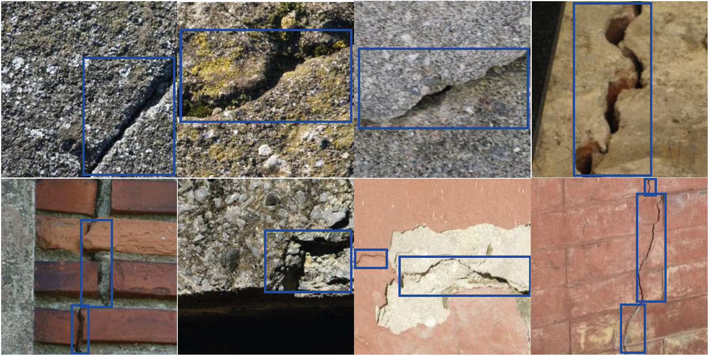

# Masonry Crack Detection Dataset

The dataset contained in this repository is a collection of crack images and their annotated bounding-box annotations. Currently, the dataset only accounts for 'Crack' defects, although it could be expanded in the future. The dataset was targeted to **detection** tasks, hence the bounding-boxes.

## Disclaimer
There might be some mislabelled defects as I do not have any civil engineering qualifications. If you find any mistakes, please open an *Issue* with the details. Thank you!

| Num Images | Crack Instances |
| :---: | :---: |
| 3291 | 5954 |

## Images

Crack images of size 224 x 224 pixels.

## Labels

The bounding-box labels are structured following the format used for YOLO format. Each image in the dataset has a corresponding '.txt' file containing the objects in the image. The text files are formatted as:

`<object-id> <x-center> <y-center> <width> <height>`

- **object-id**: integer representing the class of the object. This should start from 0 and increase by 1 for each new object class. This dataset only contains 'Crack' images, therefore `<object-id>` is always 0. In the event of adding more defects, this will be updated accordingly.

- **x/y-center**: coordinates of the bounding-box centre, normalised by the width and height of the image. Values should range within [0,1].

- **width/height**: dimensions of the bounding-boxes, normalised by the width and height of the image. Values should range within [0,1].

## Examples


## Citing this dataset

If you find this dataset useful, please consider giving a star :star: and citation :t-rex::

```
@inproceedings{marin21,
  author = {Marin, B. and Brown, K. and Erden, M. S.},
  booktitle = {2021 IEEE 17th International Conference on Automation Science and Engineering (CASE)}, 
  title = {Automated Masonry crack detection with Faster R-CNN}, 
  year = {2021},
  volume = {},
  number = {},
  pages = {333-340},
  DOI = {10.1109/CASE49439.2021.9551683}
  }
```
